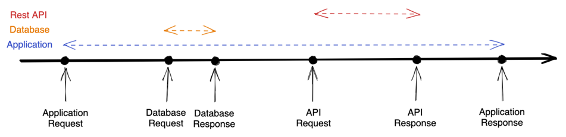

# Context
`Context` 는 테스트를 통한 성능 측정의 집계 방식을 의미합니다.  
현재, 'method' 와 'endpoint' 두 가지의 기능을 제공합니다.

해당 설정은 Spring proprety(`application.properties` or `application.yml`) 를 통해 변경할 수 있습니다.
You can configure this type using spring property(`application.properties` or `application.yml`)



어플리케이션이 요청을 받고, 데이터베이스를 쿼리한 뒤 다른 API 요청을 하는 시나리오의 테스트 코드를 작성했다고 가정해보겠습니다.

## Method
'method' 컨텍스트의 경우, Description은 아래와 같이 출력됩니다.

```log
2023-01-09 20:35:23 INFO  com.morak.performancetracker.test.{TEST_CLASS}
2023-01-09 20:35:23 INFO      {TEST_DISPLAY_NAME}
2023-01-09 20:35:23 INFO          Result{name='{OTHER_API_ENDPOINT}', elapsed=954ms}
2023-01-09 20:35:23 INFO          Result{name='{YOUR_QUERY}', elapsed=12ms}
2023-01-09 20:35:23 INFO          Result{name='GET /{YOUR_ENDPOINT}', elapsed=1259ms}
```

## Endpoint
'Endpoint'는, 어떠한 테스트가 실행했는지 여부와 관계 없이, 각 Endpoint 에 대한 측정을 실시합니다.  
아래는 이에 대한 예시입니다.

```log
2023-01-09 20:32:49 INFO  REST
2023-01-09 20:32:49 INFO      Result{name='{OTHER_API_ENDPOINT}', elapsed=954ms}
2023-01-09 20:32:49 INFO  Query
2023-01-09 20:32:49 INFO      Result{name='{YOUR_QUERY}', elapsed=12ms}
2023-01-09 20:32:49 INFO  Web
2023-01-09 20:32:49 INFO      Result{name='GET /{YOUR_ENDPOINT}', elapsed=1259ms}
```

